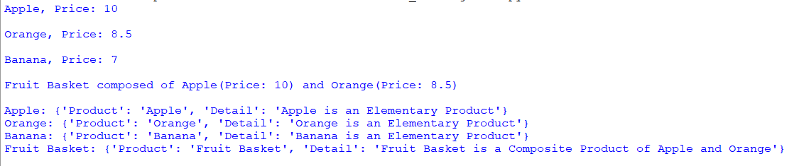

## Description
A Python program that manages and displays information about elementary and composite products. It defines classes for products, creates compositions, generates descriptions using named tuples, and stores them using defaultdict and deque.

## Screenshot

